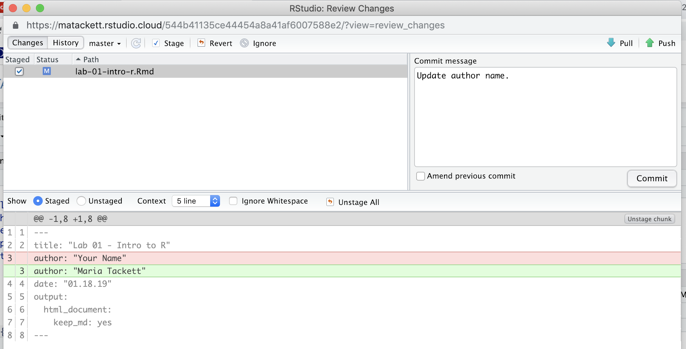

## COMP: Intro to R

```{r echo = F}
knitr::opts_chunk$set(
  eval = F
)
```

### Introduction {-}

The main goal of this assignment is to introduce you to R and RStudio, which we will be using throughout the course both to learn the statistical concepts discussed in the course and to analyze real data and come to informed conclusions. (*Note: R is the name of the programming language and RStudio is an interface.*)

An additional goal is to introduce you to git, a version control system, and GitHub, a collaboration system that is a place on the internet to host git-based projects. We will be using both of these tools throughout the seemster.

This assignment will focus on learning the basics of R and RStudio - understanding the interface, reading in data, and some basic commands. Future assignments will focus more specifically on regression analysis. This introduction to R and RStudio is not comprehensive. Students who are brand new to R should refer to {#review} for resources that provide a more comprehensive introduction to R.

This assignment should be completed **individually**, so you can get practice using git and GitHub before collaborating with others. You will work with others in future computing assignments.

#### Topics: {-}

- Exploratory Data Analysis (data visualizations and numerical summaries)
- Simple linear regression
- Writing a report using R Markdown
- Tracking changes and submitting work using git and GitHub

### Packages {-}

We will use the following packages in today's assignment. 

```{r}
library(tidyverse)
library(readr)
library(skimr)
library(broom)
```

If you need to install any of the packages, you can run the code below in the **console**.

```{r,eval=F}
install.packages("tidyverse") 
install.packages("readr")
install.packages("skimr")
install.packages("broom")
```

### Warm up {-}

#### YAML: {-}

The top of the R Markdown file (between the three dashed lines) is called the  YAML ("YAML Ain't Markup Language"). Basic information about your document, such as the title, author, output format, etc., is located in the YAML. 

Open the R Markdown (.Rmd) file in your project, change the author name to your name, and knit the document.

```{r echo = FALSE}
knitr::include_graphics("img/01-intro-r/yaml-raw-to-rendered.png")
```

#### Commiting changes: {-}

Go to the **Git** pane in RStudio.

You should see the changes you made to the Rmd file listed here. Click to select the change (or changes) you made and click **Diff** to see the difference between the last committed state of the document and the current state that now includes your changes (in this case, writing your name in the author field). Now, write a short message in the **Commit message** box (e.g. a message like "Updated author name") and click **Commit**.

```{r echo = FALSE}

```

You don't have to commit after every change, but should commit states that are meaningful and may be helpful to use later for comparision. In the early assignments, there will be guidance to help you determine when to commit, and you will choose when to commit in later assignments. 

#### Pushing changes: {-}

Once you've committed a set of changes, the next step is to push them to the repo on GitHub.com. This is to ensure others can see your changes (in this class the instructor since your repos are only visible to you and the instructor). In other words, pushing changes is how you will submit your work for grading. 

To push your changes to GitHub, click on **Push**. (*Note: If you are using RStudio Cloud, you may be asked to input your GitHub username and password. We will discuss how to save your GitHub credentials in a later assignment.*)

#### Data {-}

Today's data comes from the Capital Bikeshare in Washington D.C [@capitalbikeshare]. The Capital Bikeshare is a system in which customers can rent a bike for little cost, ride it around the city, and return it to a station near their destination. We will read in the data from the file *bikeshare.csv* located in the *data* folder.


```{r  eval=FALSE}
bikeshare <- read_csv("data/bikeshare.csv")
```

This dataset contains the number of bike rentals, environmental conditions, and other information about the Capital Bikeshare everyday in 2011 and 2012. 

### Exercises {-} 

Before doing any analysis, we want to understand the basic structure of the data. One way to do this, is to look at the actual dataset. Type the code below in the **console** to view the entire dataset.

```{r eval=FALSE}
View(bikeshare)
```

Because the dataset is large (i..e has a large number of observations), it is difficult to understand the data just by looking at the individual observations.  We can use the `glimpse` function to view a summary of the data and get a general idea about the data structure. Using this function to view the data can be especially useful when importing data from a csv file (like in this assignment) to ensure that the imported dataset has the number of observations (rows) and variables (columns) we expect. We can also use this function to see the type for each of the imported variables (integer, character, etc.).

*Note: To learn more about a function, type `??function` in the console. For example, to learn more about the `glimpse` function, type `??glimpse` in the console.*

1. Type `glimpse(bikeshare)` in the **console** an overview of the `bikeshare` dataset.

  How many observations are in the `bikeshare` dataset? How many variables?

2. In this assignment, we will focus the analysis on the following variables: 

  |  |  |
  |----------|-------|
  | `season` |1: Winter, 2: Spring, 3: Summer, 4: Fall |
  | `temp` | Temperature (in $^{\circ}C$) &divide; 41 |
  | `count` | total number of bike rentals |


  Before fitting any regression models, we want to do an exploratory data analysis (EDA) to summarize the main characteristics of the data. Much of the EDA is visual, which we'll discuss more in the next exercise. The EDA also consists of calculating summary statistics for the variables in our dataset. It is good practice to examine any variable that may be relevant to the analysis in the EDA, since there may be variables that aren't directly included in the regression model but still provide important context to fully understand the results (i.e. lurking variables). To keep this assignment manageable, we will only examine the three variables `season`, `temp`, and `count`.

  There are many ways to calculate summary statistics for each variable, and we will use a few of them throughout the semester. For now, let's use the `skim` function to calculate basic measures of center and spread and get a sketch of the distribution. 

```{r eval=FALSE}
    bikeshare %>%
      select(season,temp,count) %>%
      skim()
```

- What is the mean number of bike rentals? 
- About 25% of the days in the data have a `count` above what value? 

3. Does it make sense to calculate measures of center and spread for the variable `season`? If so, explain why it makes sense. Otherwise, explain why the `skim` function calculated these summary statistics for the variable `season` even if they don't make sense.

*Knit and commit changes with the commit message "Added summary statistics  (Ex 1 - 3)", and push.*

#### Visualizing Your Data {-}

4. One important part of EDA is visualizing the data to get a better understanding about the shape of the distribution for each variable and the relationship between variables. There are a lot of ways to make plots in R; we will use the functions available in the `ggplot2` package.

  *Note: [https://ggplot2.tidyverse.org/](https://ggplot2.tidyverse.org/) is a great resource as you learn `ggplot()`. Click **Reference** in the top right corner to see a list of the various plot types available in the ggplot2 package.*

  The code below is used to create a histogram to visualize the distribution of `count`. Modify the code by writing an informative title and label for the x-axis.

```{r eval=FALSE}
ggplot(data=bikeshare, mapping=aes(x=count)) + 
  geom_histogram() +
  labs(title="______", x="______")
```


5. There may be times you want to customize a plot by changing features such as the color, marker types, etc. When plotting a histogram, one easy way to customize it is by changing the color of the bars. Let's look at two different ways to do this. 

  First, using a color of your choice, fill in the code below to include the option `color="_____"` inside of `geom_histogram()` function. Be sure to also include an informative title and label for the x-axis. You can use the [ggplot2 quick reference](http://sape.inf.usi.ch/quick-reference/ggplot2/colour) or [HTML color codes](https://htmlcolorcodes.com/) to help choose a color.

```{r eval=FALSE}
ggplot(data=bikeshare, mapping=aes(x=count)) + 
  geom_histogram(color="_______") +
  labs(title="______", x="______")
```
  

Next, instead of `color="_____"`, use `fill="______"` inside of the `geom_histogram` code and fill in the color of your choice. It can be the same color you chose before or a different one.

What is the difference in the two plots? In other words, what is the difference in the way color displays on the histogram when using `color` versus `fill`?

6. Describe the distribution of `count`. Your description should include comments about the shape, center, spread, and any potential outliers. Refer to the histogram and the summary statistics from Exercise 2 in your description. 

*Knit and commit changes with the commit message "Added data visualization of count (Ex 4 - 6)", and push.*

7. Now that we've examined the variables individually, we want to look at the relationship between the variables. To make interpretation easier, we will use the `mutate` function to create a new variable called `temp_c` that is calculated as `temp * 41`. We will use `temp_c` for the remainder of the analysis, so the temperature can be discussed in terms of degrees Celsius. 

```{r eval=FALSE}
bikeshare <- bikeshare %>%
  mutate(temp_c = temp * 41)
```

Complete the code below to make a scatterplot of the number of bike rentals versus the temperature (in degrees Celsius).

```{r eval=FALSE}
ggplot(data=bikeshare, mapping=aes(x=temp_c,y=count)) +
  ___________________
```


Describe the relationship between the temperature and the number of bike rentals. 


8. The temperature and number of bike rentals varies greatly depending on the season. Therefore, we would like to create a separate scatterplot of `count` versus `temp_c` for each season. To do so, we will use the `facet_wrap` function, faceting by `season`. Recall from Exercise 2 that `season` is currently stored as an integer. We need to change it to a factor variable type before using it in the `facet_wrap` function. 

  Run the code below to see the replationship between temperature and number of bike rentals by season.

```{r eval=FALSE}
bikeshare <- bikeshare %>%
  mutate(season = as.factor(season))
```

```{r eval=FALSE}
ggplot(data=bikeshare, mapping=aes(x=temp_c,y=count)) + 
  geom_point() +
  labs(title = "Number of Bike Rentals vs. Temperature", 
       subtitle="Faceted by Season", 
       x = "Temperature (Celsius)", 
       y = "Number of Bike Rentals") +
  facet_wrap(~season)
```

  For which season does the linear relationship between the temperature and the number of bike rentals appear to be the strongest? 

*Knit and commit changes with the commit message "Added visualization of count vs. temperature (Ex 7 - 8)", and push.*

### Simple Linear Regression {-}

We want to fit a least-squares regression using the temperature (`temp_c`) to explain variation in the number of bike rentals (`count`) in the **winter** season. We can use the `filter` function to create a subset from the data that only includes days during the winter season. The `<-` assigns the name `winter_data` to our filtered subset. 

```{r eval=FALSE}
winter_data <- bikeshare %>%
  filter(season=="1")
```

**We will use `winter_data` for the remainder of the assignment.**

9. Modify the code below to fit a simple linear regression model using the `lm` function; assign it the name `winter_model`. Replace *X*,  *Y*, and *my.data* in the code below with the appropriate values. 

```{r eval=FALSE}
winter_model <- lm(Y ~ X, data = my.data)
tidy(model) #output model
```

- Interpret the slope. 

- Does it make sense to interpret the intercept? If so, write the interpretation of the intercept. Otherwise, explain why not. 

10. We conclude by checking the assumptions for regression. We can use the `mutate` function to add a new variable called `resid` that is the residual for each observation in `winter_data`.

```{r eval=FALSE}
winter_data <- winter_data %>%
  mutate(resid = residuals(winter_model))
```

The code to plot the residuals vs. the predictor variable and make a Normal QQ-plot of residuals is shown below. In addition to these plots, write the code to make a histogram of the residuals. Refer to code from previous exercises to help you plot the histogram.

```{r eval=FALSE}
ggplot(data=winter_data, mapping=aes(x=temp_c,y=resid)) +
  geom_point() + 
  geom_hline(yintercept=0,color="red")+
  labs(title="Residuals vs. Temperature",
       x="Temperature", 
       y="Residuals")
```


```{r eval = FALSE}
ggplot(data=winter_data, mapping=aes(sample=resid)) +
  stat_qq() + 
  stat_qq_line()+
  labs(title="Normal QQ Plot of Residuals")
```

- Based on the plots of the residuals and the scatterplot, are the linearity, normality, and constant variance assumptions met? Briefly explain your reasoning for each assumption.

- Is the independence assumption met? Briefly explain. You can use a description of the data and/or a plot to help you make this assessment.

Throughout the semester, we will learn various methods to deal with any violations in regression assumptions. For now, we will just note them.

*Knit then commit all remaining changes, write a commit message indiciating you're finished, and push to GitHub. Before you wrap up the assignment, make sure all documents are updated on your GitHub repo.*

***
