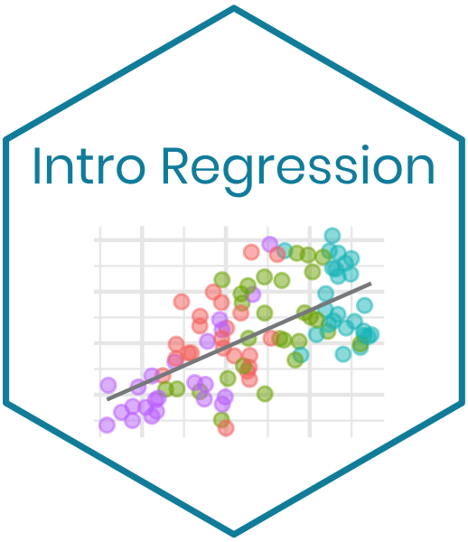

--- 
title: "Intro Regression"
author: "Maria Tackett"
date: "`r Sys.Date()`"
site: bookdown::bookdown_site
documentclass: book
bibliography: [book.bib, packages.bib]
biblio-style: apalike
always_allow_html: yes
# fontsize: '12pt, krantz2'
# monofont: "Source Code Pro"
# monofontoptions: "Scale=0.7"
link-citations: yes
colorlinks: yes
# lot: yes
# lof: yes
github-repo: "matackett/intro-regression"
graphics: yes
cover-image: "img/introregression-sticker.png"
url: https\://www.introregression.org/
apple-touch-icon: "img/introregression-sticker.png"
favicon: "img/introregression-sticker.png"
description: "Intro Regression is an electronic book with assignments and in-class activities to help students apply concepts in an intermediate-level regression analysis course. The primary focus of this text is application and computing; there are also supplemental math notes for some topics."
---

```{r echo = F}
options(knitr.duplicate.label = 'allow')
```

# Welcome to Intro Regression!

```{r, out.width='30%', fig.show='hold', fig.align = 'center', echo=FALSE}

```

This text was originally written as materials  for [STA 210: Regression Analysis](https://www2.stat.duke.edu/courses/Spring19/sta210.001/) at Duke University.The computing aspects of the assignments are written using the `tidyverse` R syntax. If R is not the computing language used in your regression course, the assignments can be adapted to fit the computing language of your choice. 

This text is a work-in-progress and will be periodically upated with new material. Please email me (<a href="mailto:maria.tackett@duke.edu">maria.tackett@duke.edu</a>) if you have any questions, feedback, or suggestions. I would also love to hear about your experience if you use the text in your course.

<a rel="license" href="http://creativecommons.org/licenses/by-nc-sa/4.0/"></a><br />

This work is licensed under the [Creative Commons Attribution-NonCommercial-ShareAlike 4.0 International License](http://creativecommons.org/licenses/by-nc-sa/4.0/).

***

## Introductory Statistics Review

The primary audience for this text is students who have completed an introductory statistics course. It is assumed that students are familiar with the concept of statitical inference. This text is also written assuming students have had some exposure to R and the tidyverse syntax. (There is one "Intro to R" assingment included; however, this assignment is not a comprehensive introduction to R.) The following are suggested texts to review statistical concepts and computing: 

- [*OpenIntro Statistics*](https://www.openintro.org/index.php)
- [*Modern Dive*](https://moderndive.com/)
- [*R for Data Science*](https://r4ds.had.co.nz/)

***

## Using This Book 

Each chapter of this book is a topic that may be covered in an intermediate-level regression analysis course. The topics are arranged based on the way they were taught in STA 210: Regression Analysis; however, the assignments do not have to be used in the order they are presented. Feel free to use the text and adapt it to fit the needs of your course. 

Each chapter includes several sections of assignments and supplmental notes about the mathematical details. Each section begins with one of the codes below to help you determine the type of assignment or note in that section: 

- **COMP**: These assignments focus on the computing skills needed to conduct regression analysis. They were originally designed to be completed in groups in a weekly lab/discussion session; however, they can be also be used for homework assignments or in-class work days. Because the emphasis is computing, they include a lot of step-by-step instruction. 

- **IN-CLASS**: Assignments to be completed as short in-class activities. Most of the code is already written, so students mostly run the code and interpret the output. Students may also need to fill in short lines of code. 

- **HW**: Focus on putting together conceptual knowledge and computing skills. Most homework assingments include two parts: (1) *Concepts & Computations* - guided short-answer exercises that focus on conceptual knowledge and short computational tasks, (2) *Data Analysis* - open-ended question where students perform a complete regression analysis and write results as a narrative. 


